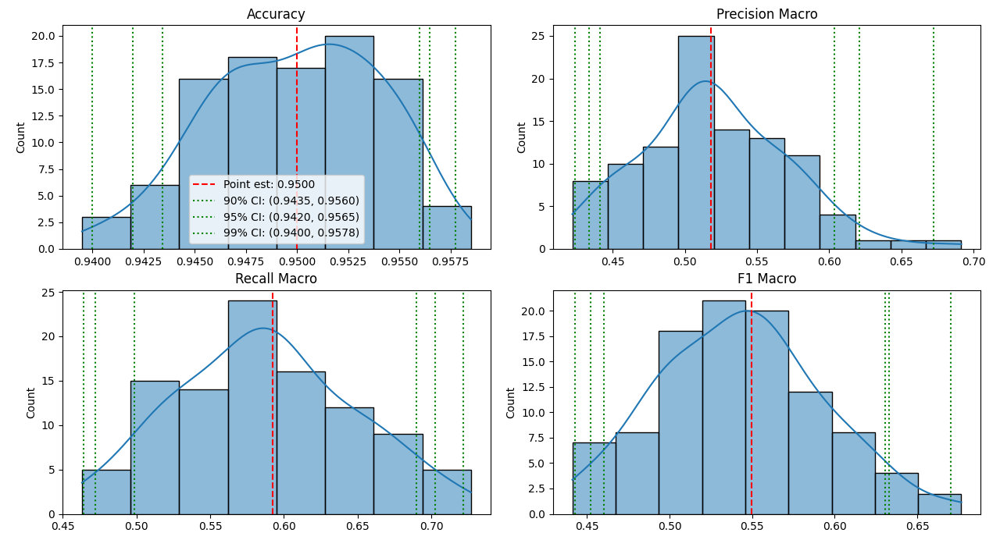
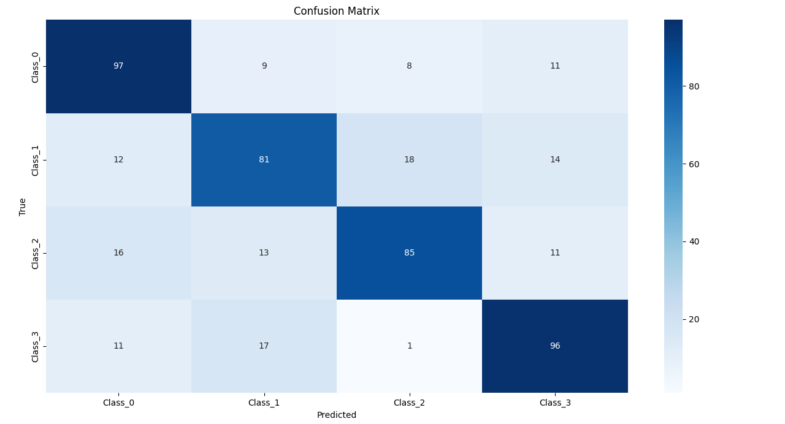

# QualiVec

**QualiVec** is a Python library for scalable qualitative content analysis powered by Large Language Model (LLM) embeddings. It enables systematic semantic similarity assessment, reference vector construction, and automated classification across diverse textual domains using a hybrid of deductive and inductive coding approaches.

## 📋 Table of Contents

- [Overview](#overview)
- [Installation](#installation)
- [Quick Start](#quick-start)
- [Core Concepts](#core-concepts)
- [Components](#components)
  - [Data Loading and Preparation](#data-loading-and-preparation)
  - [Embedding Generation](#embedding-generation)
  - [Semantic Matching](#semantic-matching)
  - [Classification](#classification)
  - [Evaluation](#evaluation)
  - [Threshold Optimization](#threshold-optimization)
  - [Sampling](#sampling)
- [Usage Examples](#usage-examples)
  - [Preparing Reference Vectors](#preparing-reference-vectors)
  - [Classifying New Data](#classifying-new-data)
  - [Evaluating Classification Performance](#evaluating-classification-performance)
  - [Optimizing Similarity Thresholds](#optimizing-similarity-thresholds)
  - [Sampling for Manual Coding](#sampling-for-manual-coding)
- [API Reference](#api-reference)
- [Best Practices](#best-practices)
- [Troubleshooting](#troubleshooting)
- [License](#license)

## 🔍 Overview

QualiVec bridges qualitative content analysis with machine learning by leveraging the semantic understanding capabilities of Large Language Models. Instead of relying on simple keyword matching or manually coding large datasets, QualiVec uses embedding vectors to capture semantic meaning and perform classification based on similarity to reference vectors.

Key features:
- LLM-based embedding generation (supports OpenAI, HuggingFace models)
- Semantic similarity assessment using cosine similarity
- Deductive and inductive coding support
- Reference vector creation from labeled corpora
- Corpus-driven clustering for robust semantic anchor construction
- Supports large-scale document classification
- Domain-agnostic and model-flexible design (works with GPT, Gemini, MiniLM, etc.)
- Human-level performance in CSR, technical, and sentiment domains
- Bootstrap evaluation with confidence intervals
- Threshold optimization for classification performance

## 💻 Installation

```bash
pip install qualivec
```

For development installation:

```bash
git clone https://github.com/AkhilVaidya91/QualiVec.git
cd qualivec
pip install -e .
```

## 🚀 Quick Start

Here's a simple example to classify text data using reference vectors:

```python
from qualivec.classification import Classifier

# Initialize classifier
classifier = Classifier(verbose=True)

# Load models
classifier.load_models(model_name="sentence-transformers/all-MiniLM-L6-v2", threshold=0.7)

# Prepare reference vectors
reference_data = classifier.prepare_reference_vectors(
    reference_path="path/to/reference_vectors.csv",
    class_column="class",
    node_column="matching_node"
)

# Classify corpus
results_df = classifier.classify(
    corpus_path="path/to/corpus.csv",
    reference_data=reference_data,
    sentence_column="sentence",
    output_path="path/to/results.csv"
)

# Display distribution of classifications
print(results_df["predicted_class"].value_counts())
```



## 🧩 Core Concepts

### Reference Vectors
Reference vectors are the semantic anchors that define each class or category. They are typically curated examples of text that represent a class well.

### Similarity Threshold
The threshold determines how similar a text must be to a reference vector to be classified as that class. Higher thresholds are more restrictive.

### Embedding
Embeddings are numerical vector representations of text that capture semantic meaning. Similar texts have similar embeddings.

### Semantic Matching
QualiVec uses cosine similarity between embeddings to determine how similar texts are to reference vectors.

### Bootstrap Evaluation
A statistical method for estimating uncertainty in evaluation metrics by resampling with replacement.

## 🧰 Components

### Data Loading and Preparation

The `DataLoader` class handles loading and validation of data:

```python
from qualivec.data import DataLoader

# Initialize data loader
data_loader = DataLoader(verbose=True)

# Load corpus
corpus_df = data_loader.load_corpus(
    filepath="path/to/corpus.csv",
    sentence_column="sentence"
)

# Load reference vectors
reference_df = data_loader.load_reference_vectors(
    filepath="path/to/reference_vectors.csv",
    class_column="class",
    node_column="matching_node"
)

# Load labeled data for evaluation
labeled_df = data_loader.load_labeled_data(
    filepath="path/to/labeled_data.csv",
    label_column="label"
)

# Save results
data_loader.save_dataframe(df=results_df, filepath="path/to/output.csv")
```

### Embedding Generation

The `EmbeddingModel` class generates embeddings from text:

```python
from qualivec.embedding import EmbeddingModel

# Initialize embedding model
model = EmbeddingModel(
    model_name="sentence-transformers/all-MiniLM-L6-v2",
    device=None,  # Auto-selects CPU or GPU
    cache_dir=None,
    verbose=True
)

# Generate embeddings for a list of texts
texts = ["This is a sample text", "Another example text"]
embeddings = model.embed_texts(texts, batch_size=32)

# Generate embeddings from a DataFrame column
embeddings = model.embed_dataframe(df, text_column="sentence", batch_size=32)

# Generate embeddings for reference vectors
reference_data = model.embed_reference_vectors(
    df=reference_df,
    class_column="class",
    node_column="matching_node",
    batch_size=32
)
```

### Semantic Matching

The `SemanticMatcher` class performs semantic matching using cosine similarity:

```python
from qualivec.matching import SemanticMatcher

# Initialize matcher with similarity threshold
matcher = SemanticMatcher(threshold=0.7, verbose=True)

# Match query embeddings against reference vectors
match_results = matcher.match(
    query_embeddings=query_embeddings,
    reference_data=reference_data,
    return_similarities=False
)

# Classify an entire corpus
classified_df = matcher.classify_corpus(
    corpus_embeddings=corpus_embeddings,
    reference_data=reference_data,
    corpus_df=corpus_df
)
```

### Classification

The `Classifier` class combines embedding and matching for end-to-end classification:

```python
from qualivec.classification import Classifier

# Initialize classifier
classifier = Classifier(verbose=True)

# Load models
classifier.load_models(
    model_name="sentence-transformers/all-MiniLM-L6-v2",
    threshold=0.7
)

# Prepare reference vectors
reference_data = classifier.prepare_reference_vectors(
    reference_path="path/to/reference_vectors.csv",
    class_column="class",
    node_column="matching_node"
)

# Classify corpus
results_df = classifier.classify(
    corpus_path="path/to/corpus.csv",
    reference_data=reference_data,
    sentence_column="sentence",
    output_path="path/to/results.csv"
)

# Evaluate classification performance
eval_results = classifier.evaluate_classification(
    labeled_path="path/to/labeled_data.csv",
    reference_data=reference_data,
    sentence_column="sentence",
    label_column="label",
    optimize_threshold=False
)
```

### Evaluation

The `Evaluator` class evaluates classification performance:

```python
from qualivec.evaluation import Evaluator

# Initialize evaluator
evaluator = Evaluator(verbose=True)

# Simple evaluation
results = evaluator.evaluate(
    true_labels=true_labels,
    predicted_labels=predicted_labels,
    class_names=class_names
)

# Bootstrap evaluation with confidence intervals
bootstrap_results = evaluator.bootstrap_evaluate(
    true_labels=true_labels,
    predicted_labels=predicted_labels,
    n_iterations=1000,
    confidence_levels=[0.9, 0.95, 0.99],
    random_seed=42
)

# Plot confusion matrix
evaluator.plot_confusion_matrix(
    confusion_matrix=results['confusion_matrix'],
    class_names=results['confusion_matrix_labels']
)

# Plot bootstrap distributions
evaluator.plot_bootstrap_distributions(bootstrap_results)
```



### Threshold Optimization

The `ThresholdOptimizer` class finds the optimal similarity threshold:

```python
from qualivec.optimization import ThresholdOptimizer

# Initialize optimizer
optimizer = ThresholdOptimizer(verbose=True)

# Optimize threshold
optimization_results = optimizer.optimize(
    query_embeddings=query_embeddings,
    reference_data=reference_data,
    true_labels=true_labels,
    start=0.5,
    end=0.9,
    step=0.01,
    metric="f1_macro",
    bootstrap=True,
    n_bootstrap=100,
    confidence_level=0.95
)

# Plot optimization results
optimizer.plot_optimization_results(
    results=optimization_results,
    metrics=["accuracy", "precision_macro", "recall_macro", "f1_macro"]
)

# Plot class distribution at different thresholds
optimizer.plot_class_distribution(
    results=optimization_results,
    top_n=10
)
```

### Sampling

The `Sampler` class helps create samples for manual coding:

```python
from qualivec.sampling import Sampler

# Initialize sampler
sampler = Sampler(verbose=True)

# Random sampling
random_sample = sampler.sample(
    df=corpus_df,
    sampling_type="random",
    sample_size=0.1,  # 10% of corpus
    seed=42,
    label_column="Label"
)

# Stratified sampling
stratified_sample = sampler.sample(
    df=corpus_df,
    sampling_type="stratified",
    sample_size=0.1,
    stratify_column="category",
    seed=42,
    label_column="Label"
)
```

## 📚 Usage Examples

### Preparing Reference Vectors

Reference vectors are the foundation of classification in QualiVec. Here's how to prepare them:

```python
# Step 1: Sample data for manual coding
from qualivec.sampling import Sampler

sampler = Sampler(verbose=True)
sample_df = sampler.sample(
    df=corpus_df,
    sampling_type="stratified",
    sample_size=0.05,  # 5% of corpus
    stratify_column="document_type"
)

# Step 2: Save sample for manual coding
sample_df.to_csv("sample_for_coding.csv", index=False)

# Step 3: After manual coding, load the coded data
from qualivec.data import DataLoader

data_loader = DataLoader(verbose=True)
coded_df = data_loader.load_labeled_data(
    filepath="coded_sample.csv",
    label_column="coded_class"
)

# Step 4: Generate embeddings for reference vectors
from qualivec.embedding import EmbeddingModel

model = EmbeddingModel(verbose=True)
reference_data = model.embed_reference_vectors(
    df=coded_df,
    class_column="coded_class",
    node_column="sentence"
)

# Step 5: Save reference data for future use
import pickle
with open("reference_data.pkl", "wb") as f:
    pickle.dump(reference_data, f)
```

### Classifying New Data

Once reference vectors are prepared, you can classify new data:

```python
# Load reference data
import pickle
with open("reference_data.pkl", "rb") as f:
    reference_data = pickle.load(f)

# Initialize classifier
from qualivec.classification import Classifier

classifier = Classifier(verbose=True)
classifier.load_models(threshold=0.7)

# Classify corpus
results_df = classifier.classify(
    corpus_path="new_corpus.csv",
    reference_data=reference_data,
    sentence_column="sentence",
    output_path="classified_corpus.csv"
)

# Analyze results
import pandas as pd
import matplotlib.pyplot as plt

# Distribution of classes
plt.figure(figsize=(10, 6))
results_df["predicted_class"].value_counts().plot(kind="bar")
plt.title("Distribution of Predicted Classes")
plt.tight_layout()
plt.show()

# Average similarity by class
results_df.groupby("predicted_class")["similarity_score"].mean().sort_values().plot(kind="barh")
plt.title("Average Similarity Score by Class")
plt.tight_layout()
plt.show()
```

### Evaluating Classification Performance

To assess how well your classification is performing:

```python
# Load labeled data
from qualivec.data import DataLoader

data_loader = DataLoader(verbose=True)
labeled_df = data_loader.load_labeled_data(
    filepath="labeled_test_set.csv",
    label_column="true_label"
)

# Generate embeddings
from qualivec.embedding import EmbeddingModel

model = EmbeddingModel(verbose=True)
labeled_embeddings = model.embed_dataframe(
    df=labeled_df,
    text_column="sentence"
)

# Initialize evaluator
from qualivec.evaluation import Evaluator
from qualivec.matching import SemanticMatcher

matcher = SemanticMatcher(threshold=0.7, verbose=True)
match_results = matcher.match(labeled_embeddings, reference_data)
predicted_labels = match_results["predicted_class"].tolist()
true_labels = labeled_df["true_label"].tolist()

evaluator = Evaluator(verbose=True)

# Simple evaluation
eval_results = evaluator.evaluate(
    true_labels=true_labels,
    predicted_labels=predicted_labels
)

# Bootstrap evaluation
bootstrap_results = evaluator.bootstrap_evaluate(
    true_labels=true_labels,
    predicted_labels=predicted_labels,
    n_iterations=1000
)

# Plot confusion matrix
evaluator.plot_confusion_matrix(
    confusion_matrix=eval_results['confusion_matrix'],
    class_names=eval_results['confusion_matrix_labels']
)

# Plot bootstrap distributions
evaluator.plot_bootstrap_distributions(bootstrap_results)
```

### Optimizing Similarity Thresholds

To find the optimal similarity threshold for your classification:

```python
# Initialize optimizer
from qualivec.optimization import ThresholdOptimizer

optimizer = ThresholdOptimizer(verbose=True)

# Optimize threshold
optimization_results = optimizer.optimize(
    query_embeddings=labeled_embeddings,
    reference_data=reference_data,
    true_labels=true_labels,
    start=0.5,
    end=0.9,
    step=0.01,
    metric="f1_macro"
)

# Plot optimization results
optimizer.plot_optimization_results(
    results=optimization_results,
    metrics=["accuracy", "f1_macro"]
)

# Plot class distribution
optimizer.plot_class_distribution(
    results=optimization_results,
    top_n=5
)

# Use the optimal threshold
optimal_threshold = optimization_results["optimal_threshold"]
print(f"Optimal threshold: {optimal_threshold}")

# Create a new matcher with the optimal threshold
matcher = SemanticMatcher(threshold=optimal_threshold, verbose=True)
```

### Sampling for Manual Coding

To create samples for manual coding or validation:

```python
from qualivec.sampling import Sampler

sampler = Sampler(verbose=True)

# Random sampling
random_sample = sampler.sample(
    df=corpus_df,
    sampling_type="random",
    sample_size=100,  # 100 documents
    seed=42
)

# Stratified sampling by predicted class
stratified_sample = sampler.sample(
    df=results_df,
    sampling_type="stratified",
    sample_size=0.1,  # 10% of corpus
    stratify_column="predicted_class",
    seed=42
)

# Save samples for manual coding
random_sample.to_csv("random_sample_for_coding.csv", index=False)
stratified_sample.to_csv("stratified_sample_for_coding.csv", index=False)
```

## 📖 API Reference

### DataLoader

```python
class DataLoader:
    def __init__(self, verbose=True)
    def load_corpus(self, filepath, sentence_column="sentence")
    def load_reference_vectors(self, filepath, class_column="class", node_column="matching_node")
    def load_labeled_data(self, filepath, label_column="label")
    def save_dataframe(self, df, filepath)
    def validate_labels(self, labeled_df, reference_df, label_column="label", class_column="class")
```

### Sampler

```python
class Sampler:
    def __init__(self, verbose=True)
    def sample(self, df, sampling_type="random", sample_size=0.1, stratify_column=None, 
               seed=None, label_column="Label")
```

### EmbeddingModel

```python
class EmbeddingModel:
    def __init__(self, model_name="sentence-transformers/all-MiniLM-L6-v2", 
                 device=None, cache_dir=None, verbose=True)
    def embed_texts(self, texts, batch_size=32)
    def embed_dataframe(self, df, text_column, batch_size=32)
    def embed_reference_vectors(self, df, class_column="class", 
                               node_column="matching_node", batch_size=32)
```

### SemanticMatcher

```python
class SemanticMatcher:
    def __init__(self, threshold=0.7, verbose=True)
    def match(self, query_embeddings, reference_data, return_similarities=False)
    def classify_corpus(self, corpus_embeddings, reference_data, corpus_df)
```

### Evaluator

```python
class Evaluator:
    def __init__(self, verbose=True)
    def evaluate(self, true_labels, predicted_labels, class_names=None)
    def bootstrap_evaluate(self, true_labels, predicted_labels, n_iterations=1000,
                          confidence_levels=[0.9, 0.95, 0.99], random_seed=None)
    def plot_confusion_matrix(self, confusion_matrix, class_names, 
                             figsize=(10, 8), title="Confusion Matrix")
    def plot_bootstrap_distributions(self, bootstrap_results, figsize=(12, 8))
```

### ThresholdOptimizer

```python
class ThresholdOptimizer:
    def __init__(self, verbose=True)
    def optimize(self, query_embeddings, reference_data, true_labels,
                start=0.0, end=1.0, step=0.01, metric="f1_macro",
                bootstrap=True, n_bootstrap=100, confidence_level=0.95, random_seed=None)
    def plot_optimization_results(self, results, metrics=None, figsize=(12, 6))
    def plot_class_distribution(self, results, top_n=10, figsize=(12, 8))
```

### Classifier

```python
class Classifier:
    def __init__(self, embedding_model=None, matcher=None, verbose=True)
    def load_models(self, model_name="sentence-transformers/all-MiniLM-L6-v2", threshold=0.7)
    def prepare_reference_vectors(self, reference_path, class_column="class", 
                                 node_column="matching_node")
    def classify(self, corpus_path, reference_data, sentence_column="sentence",
                output_path=None)
    def evaluate_classification(self, labeled_path, reference_data, 
                              sentence_column="sentence", label_column="label",
                              optimize_threshold=False, start=0.5, end=0.9, step=0.01)
```

## 💡 Best Practices

1. **Reference Vector Quality**: The quality of your reference vectors greatly impacts classification performance. Ensure they are representative and distinct.

2. **Model Selection**: Larger models generally provide better semantic understanding but are slower. For simple tasks, smaller models like MiniLM may be sufficient.

3. **Threshold Tuning**: Always optimize the similarity threshold for your specific dataset and task.

4. **Evaluation**: Use bootstrap evaluation to get confidence intervals around your metrics, especially for smaller datasets.

5. **Class Imbalance**: Be aware of class imbalance in your data. Consider using stratified sampling for creating evaluation sets.

6. **Preprocessing**: Clean and preprocess your text data before embedding for best results.

7. **Out-of-Domain Detection**: Use the "Other" class (when similarity is below threshold) to identify texts that might need new reference vectors.

## 📄 License

This project is licensed under the MIT License - see the LICENSE file for details.